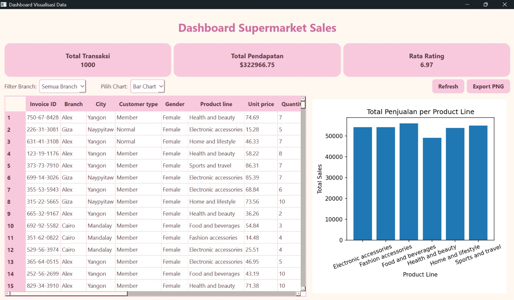
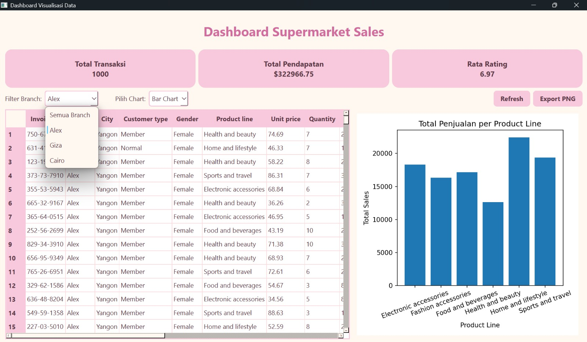
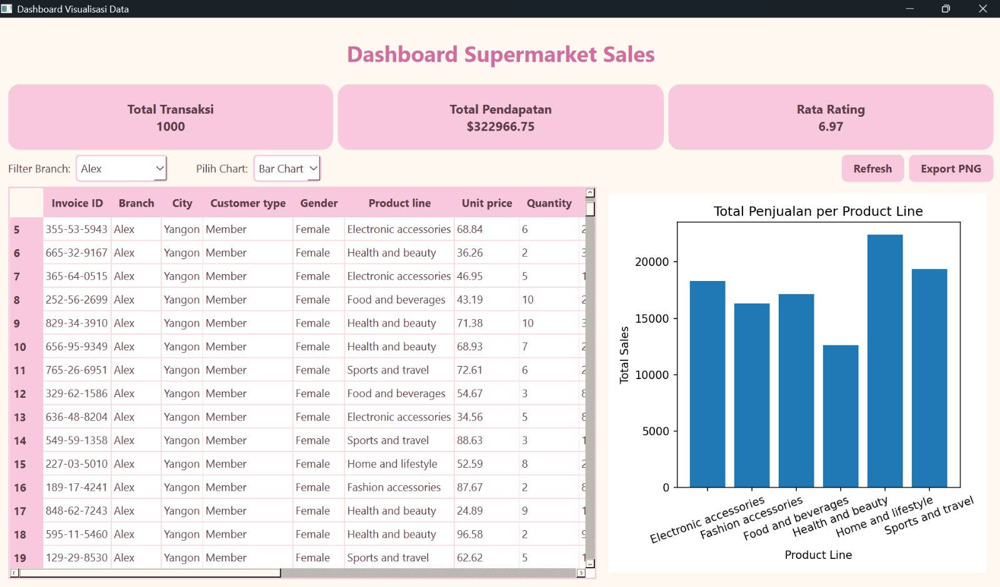
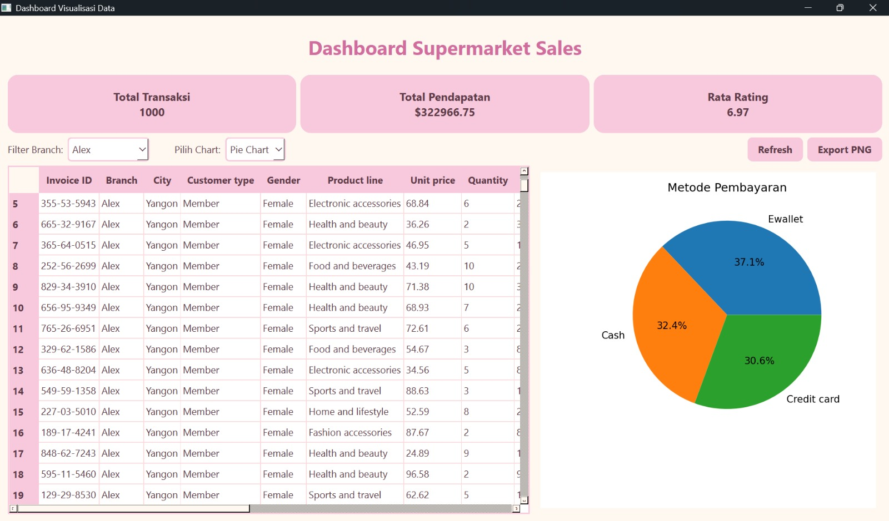
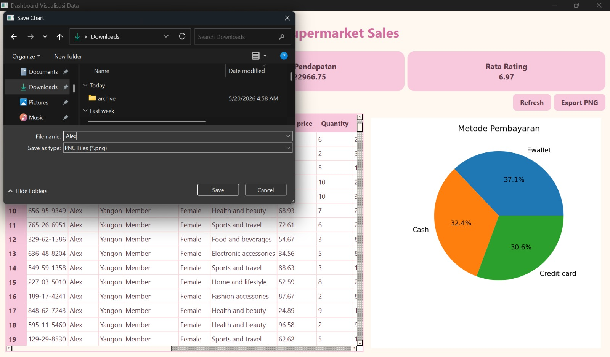
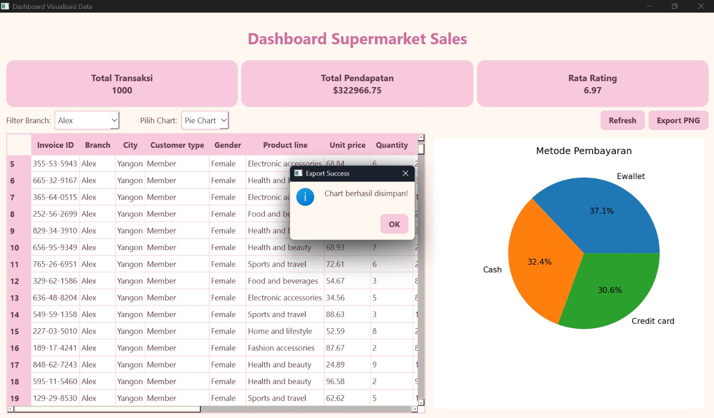
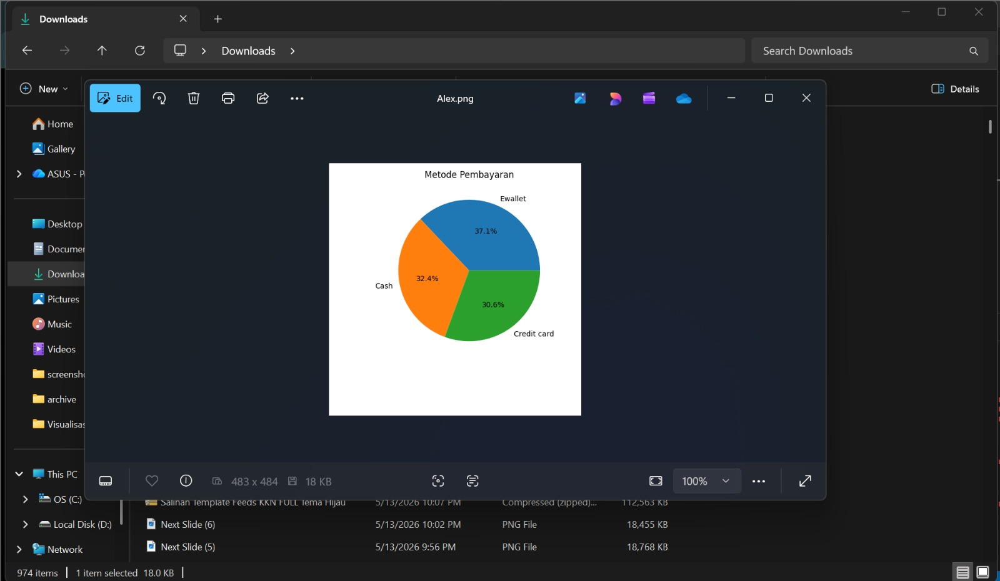
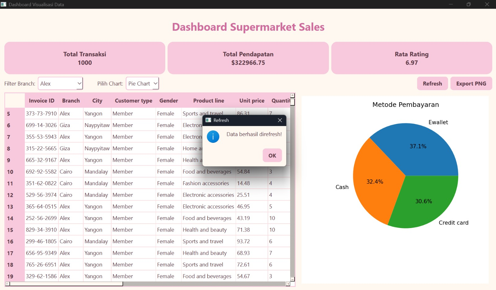

# T7-week12

# Dashboard Visualisasi Data

## Deskripsi

Project ini merupakan aplikasi dashboard visualisasi data berbasis desktop yang dibuat menggunakan PySide6 dan Matplotlib. Aplikasi ini digunakan untuk menampilkan data penjualan supermarket dalam bentuk tabel, ringkasan informasi, serta visualisasi chart yang interaktif. Dashboard dirancang agar pengguna dapat melihat informasi penjualan dengan lebih mudah dan menarik dibandingkan hanya melihat data mentah dalam bentuk spreadsheet.

Pada aplikasi ini, data transaksi supermarket ditampilkan menggunakan `QTableWidget`, kemudian divisualisasikan menggunakan chart Matplotlib yang langsung terintegrasi di dalam aplikasi PySide6 tanpa membuka jendela terpisah. Selain itu, aplikasi juga menyediakan fitur filter branch, refresh data, dan export chart ke format PNG sehingga dashboard menjadi lebih interaktif dan sesuai untuk kebutuhan analisis data sederhana.

---

## Dataset

Dataset yang digunakan adalah **Supermarket Sales Dataset** dari Kaggle:

https://www.kaggle.com/datasets/faresashraf1001/supermarket-sales

Dataset ini berisi data transaksi penjualan supermarket dengan berbagai informasi seperti:

* Invoice ID
* Branch
* City
* Customer Type
* Gender
* Product Line
* Unit Price
* Quantity
* Sales
* Payment
* Rating

Dataset ini sangat cocok digunakan untuk visualisasi data karena memiliki banyak kategori yang dapat dianalisis, seperti total penjualan berdasarkan kategori produk, metode pembayaran pelanggan, cabang supermarket, serta rating pelanggan.

---

## Fitur Aplikasi

Aplikasi dashboard memiliki beberapa fitur utama, yaitu:

* Menampilkan data transaksi dalam bentuk tabel
* Menampilkan ringkasan total transaksi
* Menampilkan total pendapatan supermarket
* Menampilkan rata-rata rating pelanggan
* Filter data berdasarkan branch/cabang supermarket
* Menampilkan Bar Chart menggunakan Matplotlib
* Menampilkan Pie Chart menggunakan Matplotlib
* Tombol refresh data dashboard
* Export chart menjadi file PNG
* Tampilan dashboard responsive saat ukuran window diubah

---
## Struktur Project

```bash
visualisasi_dashboard/
│
├── main.py
├── supermarket_sales.csv
├── README.md
│
├── data/
│   └── data_loader.py
│
├── charts/
│   └── chart_widget.py
│
└── ui/
    └── main_window.py
```
## Hasil Tampilan Aplikasi

### Tampilan Utama


### Filter Branch


### Bar Chart


### Pie Chart


### Export PNG


### Berhasil Disimpan


### File Tersimpan


### Refresh



---
